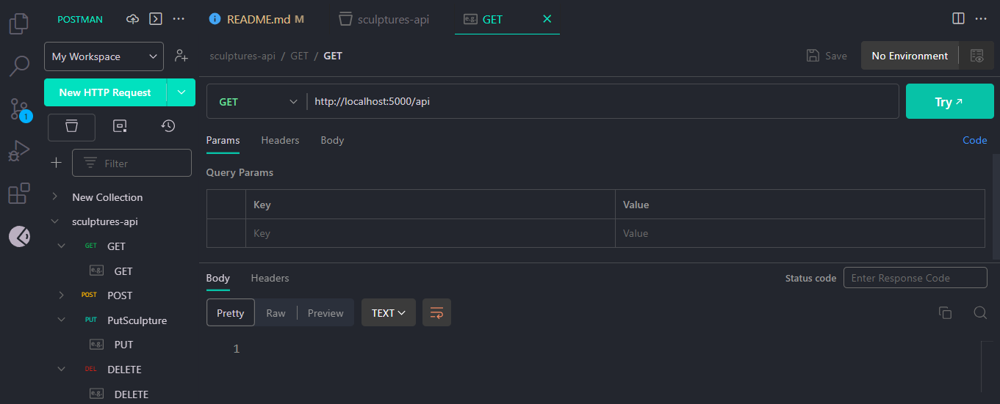
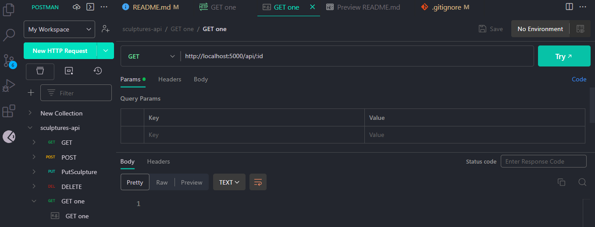
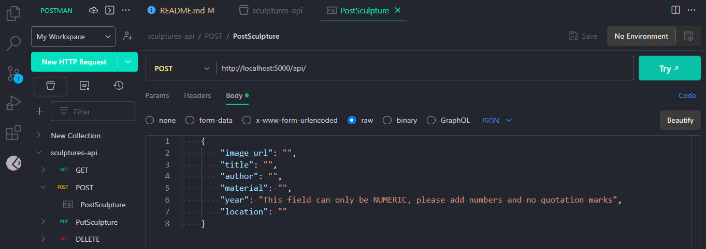
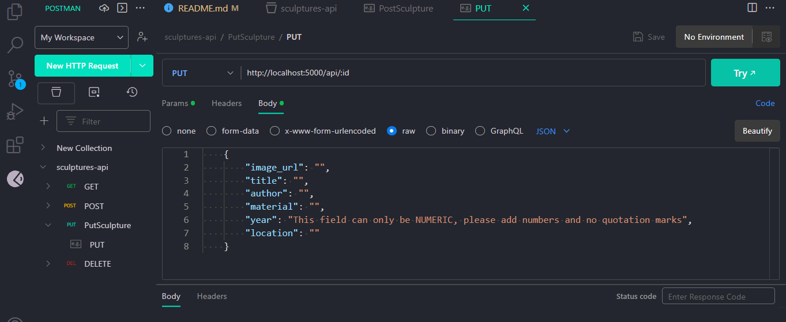
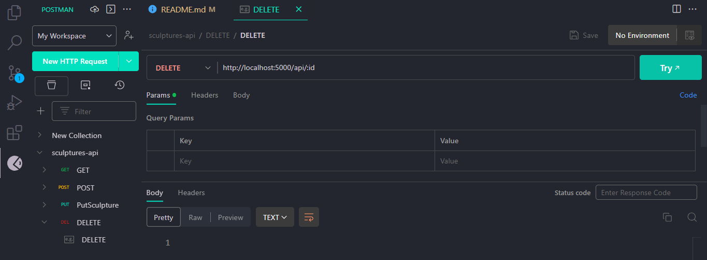

# ⚜Sculptures Musseum API⚜ #

Hello there! 🤗 Welcome to this repository where you will find an API REST of Sculptures and will be able to Create new sculptures, update, delete and see all your collection.  


- ### Step 0️⃣ Clone the repository ###
```bash
git clone https://github.com/krisneiras/MusseumAPI.git
```
This is the extension of another Front-End project, if you wish to see the app in your explore, feel free to also have a look or clone this repository as well https://github.com/BeatrizCPerez/MappSeum.git .

- ### Step 1️⃣ Install dependencies

Make sure you have Node.js installed.

```bash
npm i
```
### Develop with: 
<div>
  

   

   

   

   

  

  <div/>

- ### Step 2️⃣ Create and connect your DataBase

In this project we created our DB with mysql, so you will have to create your database and call it sculptures and another one for the tests called sculptures_test.

In the files you will see an .env_example, you rename it to .env and enter your real information:

DB_DEV_NAME=  
DB_USER=  
DB_PASSWORD=  
DB_PORT=  
DB_TEST_NAME=  

- ### Step 3️⃣ Run the server 🚀🚀

Write this command on your terminal:
```bash
npm run dev 
```
- ### Step 4️⃣ Try all requests with Postman

Here you have all requests, their endpoints and postman screenshots of all methods if you want to try them out:

GET all http://localhost:5000/api

GET one http://localhost:5000/api/id

POST http://localhost:5000/api

PUT http://localhost:5000/api/id

DELTE http://localhost:5000/api/id



### **TESTS**👨🏼‍🔬👩🏼‍🔬

To run the tests write in the terminal:
```bash
npm run test
```  
Keep in mind that you should have had created your testing database (sculptures_test)  

## COLLABORATORS
- Scrum Master: [Kristy](https://github.com/krisneiras)
- Product Owner: [Eliana](https://github.com/Elianarve)
- Web developer: [Elena](https://github.com/elenalope)
- Web developer: [Lucero](https://github.com/LuHeRiver)
- Web developer: [Jessica](https://github.com/JnogueraGonzalez)

